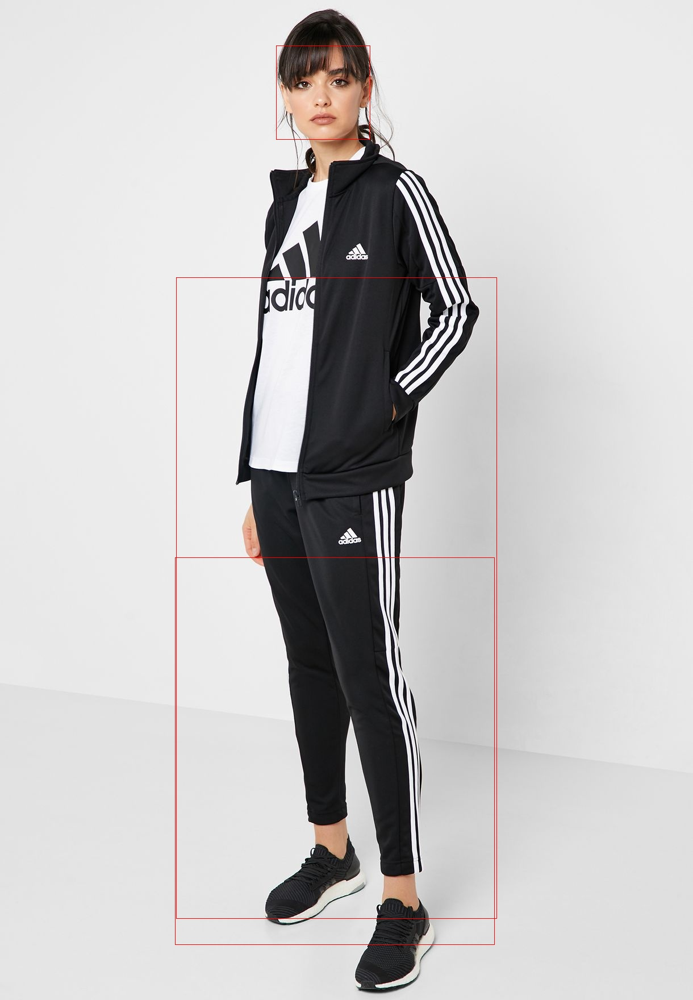

# Aplicação de reconhecimento de pessoas com Cluster[1] utilizando comunicação MPI[2].

#### N. Krüger

###### Este documento é um guia de como implementar um sistema de detecção de pessoas em um Cluster utilizando, comunicação MPI.

##### Introdução: O cluster terá um total de 5 nós, e um deles será o mestre, a função do mestre é fornecer a imagem via broadcast para os demais nós. Cada nó é responsável por reconhecer uma parte do corpo(rosto, pernas, tronco e corpo inteiro). Após o reconhecimento os escravos enviam ao mestre um retângulo com as regiões, o mestre desenha as regiões e salva as imagens. 
##### O artigo foi dividido em três partes principais, a primeira é a descrição onde é mostrado a teoria de como tudo funciona, e a segunda é o desenvolvimento que é um tutorial para a implementação do cluster e sua aplicação. A terceira é a apresentação dos resultados.

###### Fig. 1 Fluxo do processamento de imgaem

##### Descrição: Para esse trabalho foram utilizados 5 maquinas virtuais, para formar um cluster de 5 nós. Um desses nós é o mestre(m0), ele é responsável por coordenar os demais nós. Cada um dos demais nós(n0, n1, n2 e n3), fica responsável por identificar uma parte do corpo como, penas, tronco, face e corpo inteiro.

###### Fig. 2 estrutura do cluster 

##### Primeiro o mestre(m0) envia via broadcast(para todos os nós) a imagem a ser processada. Após cada nó faz a identificação da parte que o cabe e eles retornam essa informação para o mestre, que por sua vez sobrescreve a imagem com retângulos das áreas identificadas e salva a nova imagem.  

###### Fig. 3 diagrama de troca de msg 

##### Desenvolvimento(instalação do sistema): a primeiro passo para a confecção do cluster, é subir a maquina virtual no vitual box[3]. A primeira maquina a ser criada é a m0. 

###### Fig. 4 crie uma nova maquinas

###### Fig. 5 defina o nome como m0, tipo de sistema Linux[4] e distribuição Ubuntu[5].

###### Fig. 6 Para as demais definições pode deixar como padrão mas para o disco defina 30GB pois as dependências junto com o sistema operacional consomem mais de 10GB(padrão).

##### Com o nó criado é preciso baixar o sistema operacional que será instalado, no nosso caso é o Ubuntu server 20.04 que pode ser baixado no site:https://ubuntu.com/download/server

##### Agora teremos que instalar o Ubuntu no nosso nó.

###### Fig. 7 Selecione o sistema operacional baixado e inicie a instalação do sistema.

###### Fig. 8 Defina o seu nome como sendo node, o nome do server como m0, o nome do usuário como node e a senha pode ser 123. Continue a instalação e com as definições padrão.

##### Para logar no sistema basa digitar o nome do usuário seguido pela senha.

##### Desenvolvimento(instalação de pacotes e dependência):Para o funcionamento do programa alguns pacotes precisam ser instalados:

### #intala pip3
#### sudo apt update
#### sudo apt install python3-pip
### #intala mpi4py[6]
#### sudo apt install libopenmpi-dev
#### sudo pip3 install mpi4py
### #instala openCV[7]
#### sudo apt-get install cmake
#### sudo apt-get install gcc g++
#### sudo apt-get install python3-dev python3-numpy
#### sudo apt-get install libavcodec-dev libavformat-dev libswscale-dev
#### sudo apt-get install libgstreamer-plugins-base1.0-dev libgstreamer1.0-dev
#### sudo apt-get install libgtk-3-dev
#### sudo apt-get install python3-opencv
### #intalar o programa net-tools
#### sudo apt-get install net-tools

##### Desenvolvimento(configurando compartilhamento de pasta com o s.o. root): Como as operações são em cima de uma imagem precisamos dar um jeito de ter acesso a estas imagens. Como solução para esse problema, foi escolhido o compartilhamento de pastas com o s.o. root que nada mais é que seu computador.

###### Fig. 9 Vá em configurações.

###### Fig. 10 Pasta compartilhada.

###### Fig. 11 Adicione nova pasta compartilhada.

###### Fig. 12 Selecione o caminho da pasta que quer compartilhar, e o nome dela dentro da vm.

###### Fig. 13 Ligue a maquina virtual vá em dispositivos e em inseris imagem de CD.

##### No terminal da vm utiliza os seguintes comandos:
##### 
##### Para montar o CD:
##### sudo mkdir /media/cdrom
##### sudo mount -t iso9660 /dev/cdrom /media/cdrom
##### 
##### Instalar dependências do virtuakBox:
#####  sudo apt-get update
##### sudo apt-get install -y build-essential linux-headers-`uname -r`
##### 
##### Rode o script de isntalação:
##### sudo /media/cdrom/./VboxLinuxAdditions.run
##### 
##### Reinicie a VM:
##### sudo shutdown -r now
##### 
##### Crie o diretório shared no home:
##### mkdir ~/shared
##### 
##### Monte o diretório compartilhado no host ~/shared
##### sudo mount -t vboxsf shared ~/shared
#####  
##### Agora já temos o diretório compartilhado com o root. Obs.: toda vez que for reiniciar a maquina é preciso montar novamente o diretório compartilhado com o comando:
##### sudo mount -t vboxsf shared ~/shared
##### 
##### Desenvolvimento(mosntando estrutura do cluster): Agora precisamos mudar o adaptador de rede e clonar o nó mestre e configurar o mestres e escravos.

###### Fig. 14 Mudar o adaptador de NAT para o modo Bridge.

###### Fig. 15 Clonar o m0, no meu caso vou chamar ele de n0.

###### Fig. 16 Mudar o endereço mac, do adaptador de rede do n0, para evitar conflito com o m0.

##### Como n0 é um clone de m0, n0 vai estar configurado com o nome m0, para alterar basta ir em /etc/hostname e editar o arquivo alterando nome para n0, pode utilizar o comando:
##### 
##### sudo nano /etc/hostname
##### 
##### Utilize o comando ifconfig nas duas maquinas, anote o ip das duas, e edit o arquivo /etc/hosts, colocando o ip seguido do nome das maquinas, nas duas maquinas.
##### 
##### sudo nano /etc/hostname    
##### 
##### Desenvolvimento(montando compartilhamento de pasta entre os nós):
##### no m0:
##### sudo mkdir /mirror  # dentro da pasta do usuario user - trocar para o #caminho da dua pasta
##### 
##### sudo apt-get install nfs-kernel-server
##### 
##### echo "/home/node/mirror *(rw, no_root_squash)" | sudo tee -a /etc/exports
##### 
##### sudo service nfs-kernel-server restart
##### 
##### no n0:
##### sudo apt install nfs-common
##### sudo mount master:/home/node/mirror ./mirror
##### #comando mount tem que ser aplicado toda vez que reiniciar a maquina
##### 
##### Desenvolvimento(criando chave ssh):  Para o funcionamento do MPI é necessário a utilização de chaves para acesso aos outros nós.
##### Nó m0:
##### ssh-keygen -t rsa
##### cd .ssh
##### cat id_rsa.pub >> authorized_keys
##### cd ..
##### cd mirror
##### cp ../.ssh/authorized_keys ./
##### ssh n0
##### exit
##### 
##### Nó n0:
##### ssh-keygen -t rsa
##### cd mirror
##### cp authorized_keys ../.ssh
##### ssh master
##### exit
##### 
##### Desenvolvimento(baixando xml): Para o funcionamento da aplicação, é preciso baixar um a série de xml no site:
##### https://github.com/opencv/opencv/tree/master/data/haarcascades
##### Pode baixar no próprio root, e mover os arquivos para a pasta de compartilhada entre o root e o nó, depois só mover para a pasta mirror.
##### 
##### Desenvolvimento(organização do sistema de arquivos da aplicação): A aplicação tem 3 pastas principais:
##### * app: É a pasta em que fica o código fonte do programa.
##### * xml: É onde fica os xml utilizados pela aplicação.
##### * data: Pasta onde fica armazenado as imagens utilizadas pelo programa.

###### Fig. 17 hierarquia de arquivos da aplicação.

##### Desenvolvimento(código fonte do programa[8]):

###### Fig. 18 código fonte da aplicação.

##### Desenvolvimento(Clonando outros nós): Com o sistema de arquivos, do programa organizado. Basta clonar o no s0, 3 vezes, e fazer as mesmas etapas de mudar o nome das maquinas, mudar o endereço mac das placas de rede, mudar o nome das maquinas, tanto no virtual box como no /etc/hostname, verificar o ip de cada maquina, atualizar o arquivo /etc/ hosts de todos os nós com os ip e os nomes das maquinas, e por fim montar a pasta mirror em todo os nós escravos.
##### 
##### Desenvolvimento(rodando aplicação); Para rodar a aplicação é preciso criar um arquivo com qualquer nome, no meu caso vai ser maquina, e dentro dele escrever o nome de todas as maquinas do nó:
##### 
##### m0
##### n0
##### n1
##### n2
##### n3
##### 
##### Coloque este arquivo dentro do sistema de arquivos da aplicação na pasta app e rode  o seguinte comando dentro da pasta app:
##### 
##### mpirun --hostfile maquinas python3 script.py
##### 
##### Depois basta mover o arquivo ./data/imageFinal.jpg para a pasta, compartilhada com o root e verificar o resultado.
##### 
##### Resultados: Ao verificar a imagem pude validar o funcionamento do cluster

###### Fig. 19 imagem original.

###### Fig. 20 imagem processada pelo cluster.

##### Podemos perceber que a imagem processada pelo cluster destacou as partes de interesse que são as perna, o torço, o corpo completo, sendo que no corpo completo podemos perceber que ele não conseguiu indicar toda a área referente ao corpo faltando a cabeça e os ombros, mas isso deve ao programa utilizado para captura de corpo e não a estrutura do cluster.
##### 
##### Conclusão: O gargalo(parte mais lenta) dessa aplicação é justamente a analise da imagem feita por cada nó escravo, em um ambiente com maquinas reais formando um Cluster, teríamos um ganho maior de desempenho. Mas como estamos trabalhando em um ambiente virtual, essa aplicação demora em torno de uns 5 segundos para ser executada , em um ambiente real acredito que essa aplicação demore menos de 1 segundo para ser feita pois testei, o tempo de execução de um a operação de analise de imagem e essa retornou em menos de um segundo. E com o paralelismo conseguido pelo cluster poderíamos fazer mais de uma execução simultânea.             
##### 
##### 
##### N. Krüger (aluno Unisinos: )
##### 
##### E-mail: nicolas.nkruger@gmail.com
##### 
##### github: https://github.com/nicolaskruger
##### 
##### References
##### 1. https://www.infowester.com/cluster.php acessado dia 23-28/05/2020
##### 2.  https://mpi4py.readthedocs.io/ acessado dia 23-28/04/2020
##### 3.   https://www.virtualbox.org/ acessado dia 23-28/05/2020
##### 4.   https://www.kernel.org/ acessado dia 23-28/05/2020
##### 5.   https://ubuntu.com/ acessado dia 23–28/05/2020
##### 6.  https://mpi4py.readthedocs.io/en/stable/tutorial.htmlacessado dia 23–28/05/2020
##### 7.  https://opencv.org/ acessado dia 23–28/05/2020
##### 8. https://medium.com/data-science-br/reconhecimento-facial-em-python-com-a-biblioteca-opencv-be500c3ebcb3 acessado dia 23–28/05/2020
##### 
##### 
##### Repositorio Git. https://github.com/nicolaskruger/mpiCluster
##### acessado dia 10 – 18/05/2020
